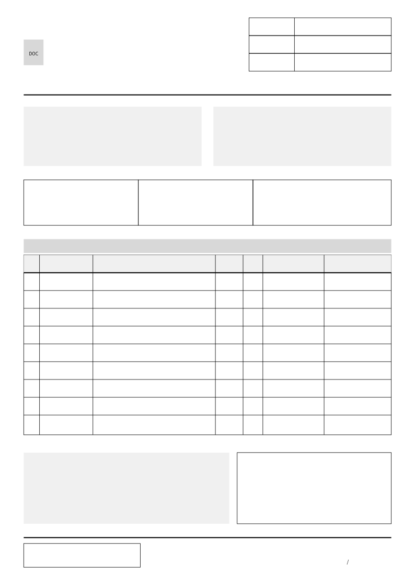
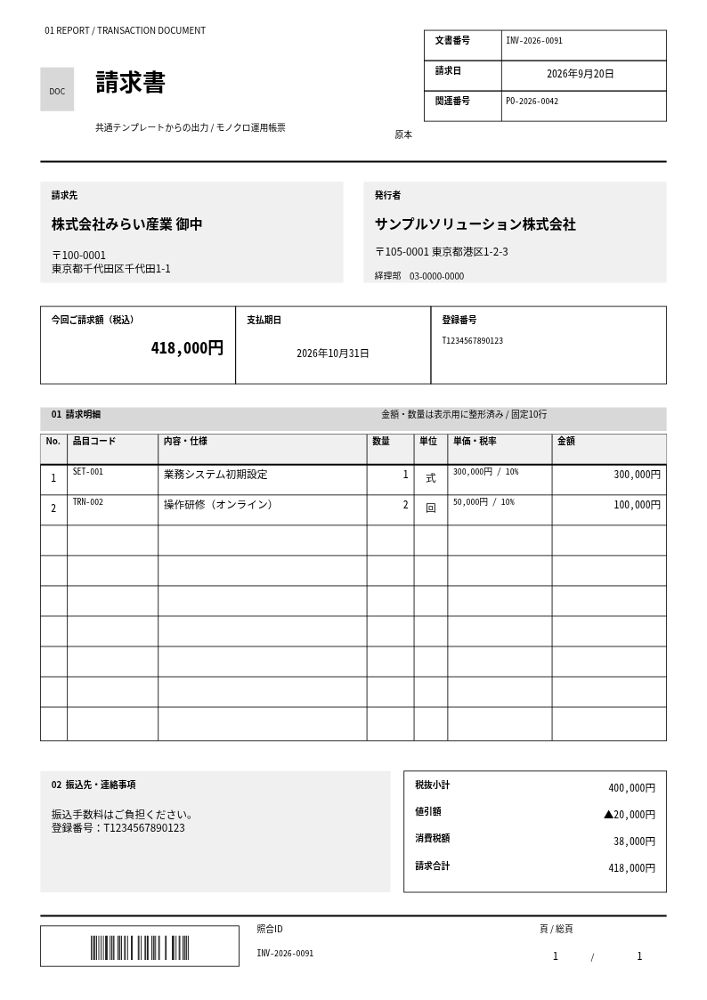
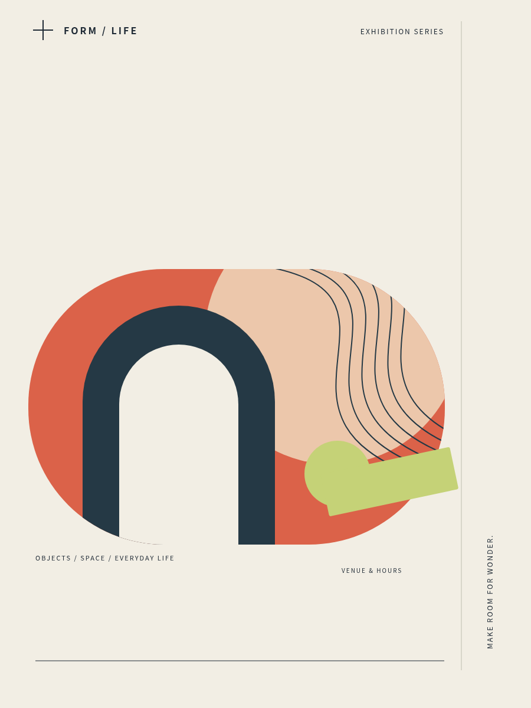
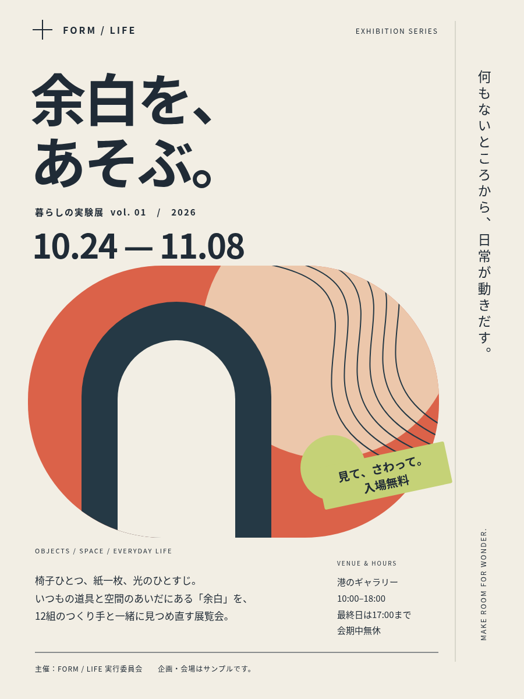
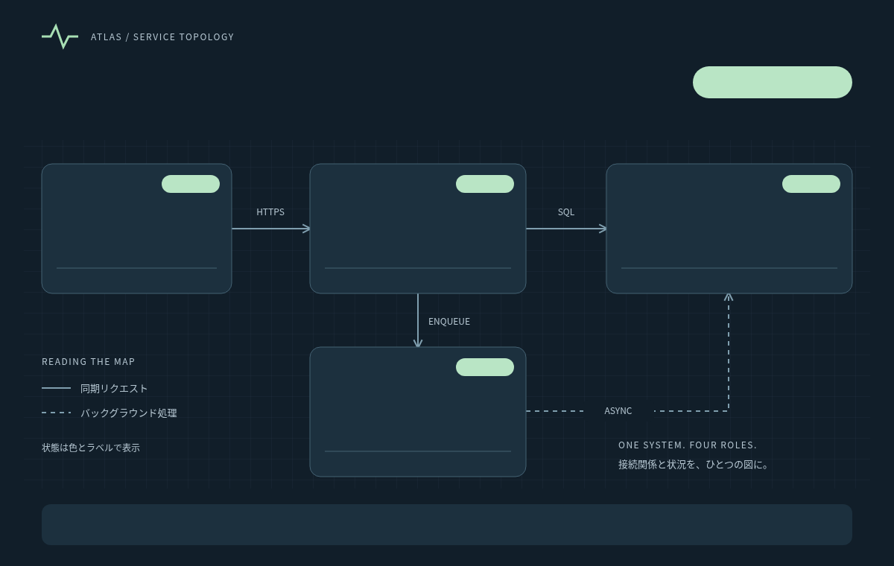
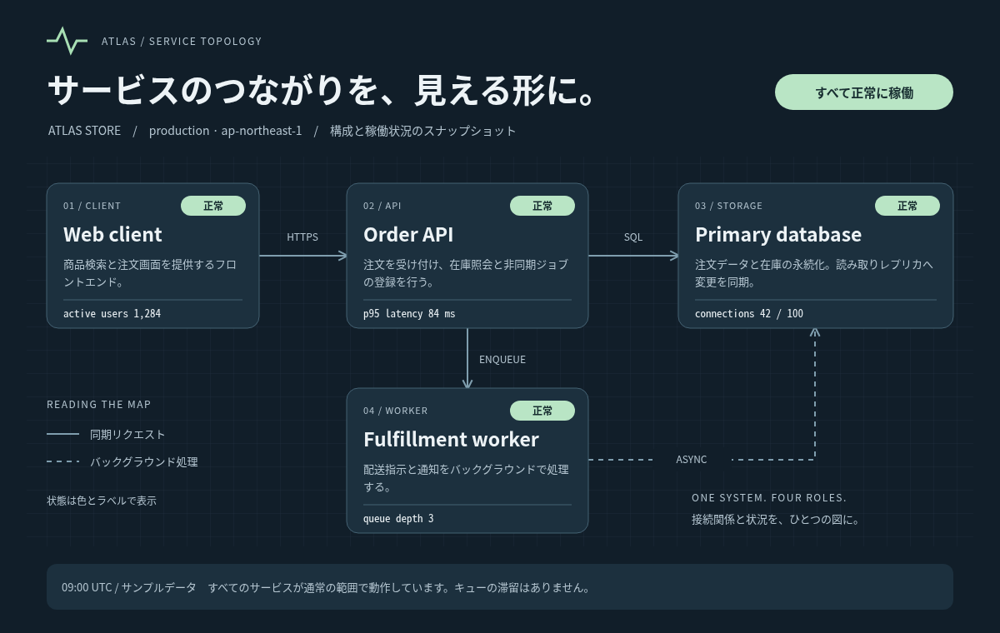

# SVG Report Builder

**Design in SVG. Populate from Python.**

SVGで作った固定レイアウトに、Pythonからテキスト、画像、
構造化データを差し込むためのライブラリです。

レイアウトは使い慣れたSVGエディターで作成します。
Pythonでは「どの枠に、どのデータを入れるか」だけを定義します。

| 種類 | テンプレート | 結果 |
| --- | --- | --- |
| 請求書 | [](examples/transaction_documents/template.svg) | [](examples/transaction_documents/output-invoice.svg) |
| イベントポスター | [](examples/event_poster/template.svg) | [](examples/event_poster/output-event-poster.svg) |
| サービス構成図 | [](examples/service_map/template.svg) | [](examples/service_map/output-service-map.svg) |

レイアウトは使い慣れた SVG エディターで作り、Python では「どの枠に、どのデータを入れるか」だけを定義します。請求書、伝票、点検表、ポスターなど、枠の位置や数が決まっているレイアウトに向いています。

## 特徴

- ID 付きの SVG `rect` にテキストや画像を配置
- HTML/CSS による文字の折り返し、余白、配置、画像のフィット
- 配列データをテンプレート上の固定枠へ割り当て
- データに応じて背景色や枠線を変更
- 同じテンプレートと異なるデータから複数の SVG を生成
- 実行時の外部ライブラリ依存なし

SVG の図形を自動配置するライブラリではありません。レイアウトはテンプレート側で固定し、データの差し込みに専念します。

## クイックスタート

SVG の `rect` を差し込み先として用意し、その ID とデータのパスを対応付けます。次のコードは `output.svg` を生成します。

```python
from pathlib import Path

from svgreportbuilder import SvgReportTemplate, TextField

template_svg = """
<svg xmlns="http://www.w3.org/2000/svg"
     width="360" height="120" viewBox="0 0 360 120">
  <rect id="customer_box" x="16" y="16" width="328" height="36"
        fill="white" stroke="#ccc"/>
  <rect id="amount_box" x="16" y="68" width="328" height="36"
        fill="white" stroke="#ccc"/>
</svg>
"""

text_style = {
    "font-family": "sans-serif",
    "font-size": "16px",
    "padding": "6px 8px",
}

report = SvgReportTemplate(
    svg=template_svg,
    fields=[
        TextField(
            target_id="customer_box",
            value_path="customer.name",
            container_style=text_style,
        ),
        TextField(
            target_id="amount_box",
            value_path="amount",
            container_style=text_style | {"text-align": "right"},
        ),
    ],
)

output_svg = report.render({
    "customer": {"name": "株式会社サンプル 御中"},
    "amount": "12,000円",
})
Path("output.svg").write_text(output_svg, encoding="utf-8")
```

`SvgReportTemplate` は SVG 文字列とフィールド定義を保持し、`render(data)` は生成結果を SVG 文字列で返します。ファイルの読み書きや金額・日付の書式設定は呼び出し側で行います。

## 主な機能

### 配列を固定枠へ割り当てる

`FixedSlots` は、配列の要素をテンプレートに用意した枠へ順番に割り当てます。

```python
from svgreportbuilder import FixedSlots, TextField

items_field = FixedSlots(
    value_path="items",
    capacity=5,
    index="row",
    fields=[
        TextField(
            target_id="item_{row}_name_box",
            value_path="name",
            container_style={"font-size": "14px", "padding": "4px"},
        ),
    ],
)
```

テンプレートには `item_0_name_box` から `item_4_name_box` までの `rect` を用意します。データ件数が `capacity` を超えると `SvgDataError` になります。空き枠は空欄のまま残ります。

### 画像を埋め込む

`ImageSource` に画像のバイト列と MIME タイプを渡します。画像は Data URI として出力 SVG に埋め込まれるため、生成後に元画像を一緒に配布する必要はありません。

```python
from pathlib import Path

from svgreportbuilder import ImageField, ImageSource

logo_field = ImageField(
    target_id="logo_box",
    value_path="company.logo",
    default=None,
    container_style={"padding": "4px"},
)

data = {
    "company": {
        "logo": ImageSource(
            data=Path("logo.png").read_bytes(),
            mime_type="image/png",
        ),
    },
}
```

画像は既定で縦横比を保ったまま枠内に収まります。PNG のほか、`mime_type="image/svg+xml"` として SVG 画像も渡せます。

### データを参照する

`value_path` はドット区切りで、辞書のキーと配列の添字をたどります。

| 指定例 | 参照先 |
| --- | --- |
| `customer.name` | `customer` にある `name` |
| `items.0.name` | `items` の先頭要素にある `name` |
| `name`（`FixedSlots` 内） | その枠に割り当てられた要素の `name` |
| `$.company.name`（`FixedSlots` 内） | ルートデータの `company.name` |

値が見つからない場合はフィールドの `default` を使い、未指定なら `SvgDataError` になります。`None` は欠落と区別され、テキストでは空欄、画像では未生成として扱われます。テキスト値は HTML ではなくプレーンテキストとして挿入されます。

### 見た目を調整する

各フィールドには CSS プロパティを文字列の辞書で指定できます。

| 引数 | 適用先 |
| --- | --- |
| `container_style` | テキストや画像を入れる XHTML `div` |
| `foreign_object_style` | SVG `foreignObject` |
| `image_style` | `ImageField` が生成する XHTML `img` |

`target_fill_path` と `target_stroke_path` を使うと、データから対象 `rect` の背景色と枠線色を変更できます。`hide_target=True` は元の `rect` を隠し、`remove_stroke=True` は枠線だけを非表示にします。

## テンプレートの要件

差し込み先には SVG 名前空間の ID 付き `rect` を使います。

- `x`、`y`、`width`、`height` を属性で指定し、幅と高さを正数にする
- 座標と寸法には数値、または `mm`、`cm`、`in`、`pt`、`pc`、`px` 付きの数値を使う
- SVG 内の ID とフィールドの差し込み先を重複させない
- 対象 `rect` 自身には `transform` を指定しない
- `defs` などの非表示定義内に差し込み先を置かない

対象枠の直後に同じ領域の `foreignObject` を追加し、その中に XHTML を生成します。元の枠は残るため、必要に応じてテンプレートで `fill="none"` や `stroke="none"` を指定してください。

## サンプル

各ディレクトリには SVG テンプレート、フィールド定義、サンプルデータ、生成スクリプトがあります。

| サンプル | 内容 | 出力例 |
| --- | --- | --- |
| [`transaction_documents`](examples/transaction_documents/) | 同じテンプレートから見積書・発注書・請求書・納品書を生成 | [請求書](examples/transaction_documents/output-invoice.svg) |
| [`receipt`](examples/receipt/) | PNG ロゴを埋め込んだ領収書 | [領収書](examples/receipt/output-receipt.svg) |
| [`work_order`](examples/work_order/) | 固定行と確認欄を持つ横向き帳票 | [作業指示書](examples/work_order/output-work-order.svg) |
| [`event_poster`](examples/event_poster/) | 文言と色を差し替えたポスター | [ポスター](examples/event_poster/output-event-poster.svg) |
| [`exhibition_map`](examples/exhibition_map/) | 展示内容と混雑状況を差し替えた案内図 | [会場マップ](examples/exhibition_map/output-exhibition-map.svg) |
| [`service_map`](examples/service_map/) | 正常時と障害時のサービス構成図 | [サービス構成図](examples/service_map/output-service-map.svg) |

リポジトリのルートから生成スクリプトを実行できます。

```bash
python -m examples.transaction_documents.render
python -m examples.receipt.render
python -m examples.work_order.render
python -m examples.event_poster.render
python -m examples.exhibition_map.render
python -m examples.service_map.render
```

冒頭のプレビュー画像は、Chromium のヘッドレスモードでテンプレートと生成済み SVG を描画したものです。

## 表示環境と制約

出力の表示には `foreignObject` 内の HTML/CSS を扱えるブラウザーを使用してください。文字の折り返しやフォントは表示環境に依存するため、PDF 変換などを行う場合も利用先で表示を確認してください。サンプルは日本語フォントとして `Noto Sans CJK JP` を優先します。

次の処理は対象外です。

- データ件数に応じた行の自動生成
- 文字量に応じた枠の自動拡張
- 自動改ページ
- 金額や日付の書式設定
- SVG から PDF への変換

複数ページが必要な場合は、呼び出し側でデータをページ単位に分けて `render()` します。PDF が必要な場合は、生成した SVG を Chrome / Chromium などで印刷してください。

## エラー

テンプレートの構築時にフィールド定義と SVG を、`render(data)` 時に入力データを検証します。

| 例外 | 主な原因 |
| --- | --- |
| `SvgSpecError` | フィールド定義、データパス、スタイル指定の不正 |
| `SvgTemplateError` | SVG の構文、差し込み先の欠落、座標の不正 |
| `SvgDataError` | 必須データの欠落、値の型、固定枠の件数の不正 |

これらをまとめて処理する場合は、基底例外の `SvgRenderError` を捕捉できます。

## ライセンス

MIT License。詳細は [LICENSE](LICENSE) を参照してください。
